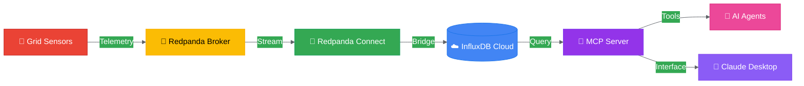
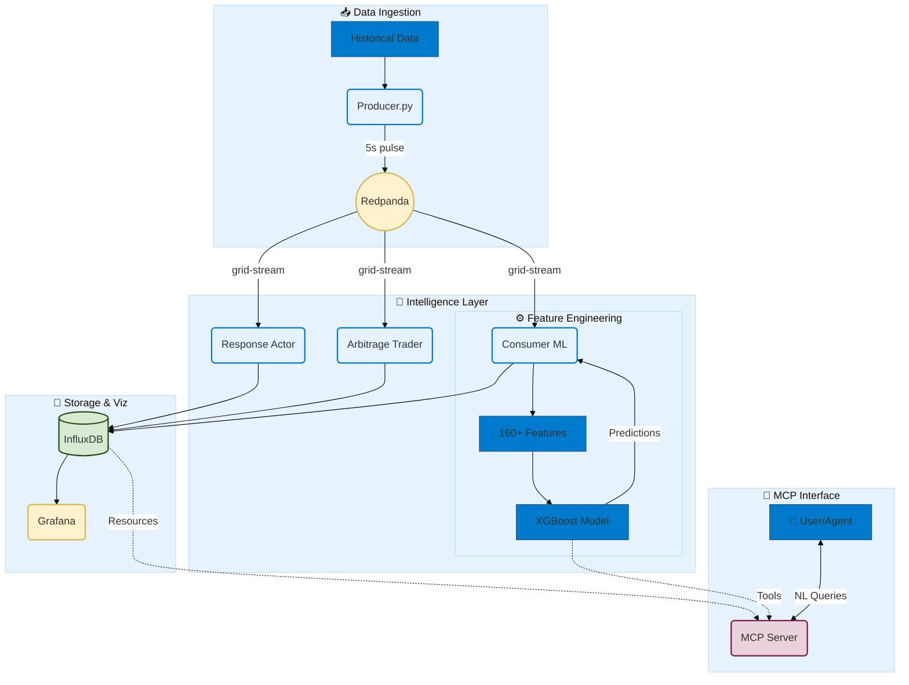
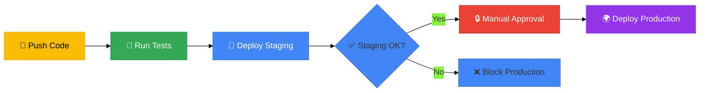

<div align="center">

# ⚡ SmartGrid-AI

### *Intelligent Virtual Power Plant Platform*

**Real-time grid intelligence powered by ML, streaming data, and autonomous agents**

[](https://github.com/dvouna/grid_twin_virtual_power_plant-/actions)
[](https://www.python.org/)
[](https://cloud.google.com/run)
[](LICENSE)
[](#-system-architecture)

[Features](#-key-features) • [Architecture](#-system-architecture) • [Quick Start](#-quick-start) • [Documentation](#-technical-deep-dive) • [Roadmap](#-roadmap)

</div>

---

## 🎯 Overview

SmartGrid-AI is a production-ready **Virtual Power Plant (VPP)** platform that transforms raw grid telemetry into intelligent, real-time operational decisions. By combining streaming data ingestion, stateful feature engineering, predictive ML models, and autonomous control agents, it enables:

- **Grid Stabilization** – Detect and respond to frequency instabilities in real-time
- **Economic Optimization** – Execute energy arbitrage strategies (buy low, sell high)
- **Predictive Intelligence** – Forecast load ramps and renewable generation patterns
- **Autonomous Operations** – AI agents that reason over grid state and take action

---

## ✨ Key Features

<table>
<tr>
<td width="50%">

### 🧠 **AI-Powered Decision Engine**

- MCP-based "brain" hosted on Cloud Run
- Natural language AI Copilot via **Gemini + MCP**
- Autonomous reasoning and tool execution
- Real-time load forecasting and anomaly detection

</td>
<td width="50%">

### 📊 **Real-Time Intelligence**

- Streaming ingestion from Redpanda/Kafka
- Stateful feature engineering (160+ features)
- XGBoost predictive models
- InfluxDB time-series storage

</td>
</tr>
<tr>
<td width="50%">

### 🤖 **Autonomous Agents**

- **Grid Response Actor** – Dispatch batteries to stabilize frequency
- **Arbitrage Trader** – Execute charge/discharge cycles for profit
- **Predictive Consumer** – ML-driven load forecasting
- **Battery Manager (BAM)** – Gatekeeper protecting battery health & SoC

</td>
<td width="50%">

### 🚀 **Production-Grade Infrastructure**

- Multi-environment CI/CD (staging → production)
- Workload Identity Federation (WIF) security
- Secret management via GCP Secret Manager
- Automated health checks and rollbacks

</td>
</tr>
<tr>
<td width="100%" colspan="2">

### 📊 **Streamlit Dashboard**

- **Grid Status** — Live net load, solar & wind telemetry from InfluxDB Cloud
- **Energy Trader** — Arbitrage revenue & battery cycle visualisation
- **Agent Operations** — Real-time dispatch log & battery State of Charge
- **AI Assistant** — Natural language chat powered by Gemini 1.5 Flash + MCP tools

</td>
</tr>
</table>

---

## 🏗️ System Architecture

### High-Level Data Flow



### Microservices Architecture



---

## 🚀 Quick Start

### Prerequisites

- **Python 3.10+** (3.14 recommended — required for `mcp` package)
- **InfluxDB Cloud** account
- **Redpanda/Kafka** (optional, for streaming)
- **GCP Account** (for Cloud Run deployment)
- **Google AI Studio API Key** (for Gemini AI Copilot)

### Installation

```bash
# Clone the repository
git clone https://github.com/dvouna/grid_twin_virtual_power_plant-.git
cd grid_twin_virtual_power_plant-

# Create virtual environment
python -m venv .venv
source .venv/bin/activate  # On Windows: .venv\Scripts\activate

# Install dependencies
pip install -r requirements.txt
```

### Environment Variables

Copy `.env.example` to `.env` and fill in your credentials:

| Variable | Description | Default |
|:---------|:------------|:--------|
| `INFLUX_CLOUD_URL` | InfluxDB Cloud endpoint | — |
| `INFLUX_CLOUD_TOKEN` | InfluxDB authentication token | — |
| `INFLUX_CLOUD_ORG` | InfluxDB organization name | — |
| `INFLUX_CLOUD_BUCKET` | InfluxDB bucket name | `energy` |
| `BAM_API_KEY` | Battery Asset Manager API secret | `changeme-in-production` |
| `GEMINI_API_KEY` | Google AI Studio key for AI Copilot | — |
| `GEMINI_MODEL` | Gemini model name | `gemini-1.5-flash` |
| `MCP_SERVER_URL` | MCP server URL | `http://localhost:8080` |

Get a free Gemini API key at [aistudio.google.com](https://aistudio.google.com/app/apikey).

### Running Locally

> ⚠️ **Important:** Always use the `.venv` Python to run scripts. The `mcp` package requires Python 3.10+ and will fail if the system Python is older.

```powershell
# 1. Start the Battery Asset Manager (BAM)
$env:PYTHONPATH="src"
python src/vpp/agents/battery_manager.py

# 2. Start the MCP Server (The Brain)
python src/vpp/mcp/mcp_server.py

# 3. Start Autonomous Agents (in separate terminals)
python src/vpp/agents/grid_response_actor.py
python src/vpp/agents/arbitrage_trader.py

# 4. Start Data Pipeline
python scripts/producer.py
python scripts/consumer_ml.py

# 5. Start the Streamlit Dashboard (must use venv Streamlit)
.venv\Scripts\streamlit run dashboard\app.py
```

### Deploying to Cloud Run

The project includes a production-ready CI/CD pipeline:

1. **Push to `develop`** → Auto-deploys to **staging**
2. **Merge to `main`** → Deploys to **staging** → **production** (with approval)

```bash
# Trigger deployment
git push origin develop  # Staging
git push origin main     # Production (after staging validation)
```

---

## 📁 Project Structure

```
grid_twin_virtual_power_plant-/
├── .github/workflows/       # CI/CD pipelines
│   └── deploy-cloud-run.yml
├── src/vpp/
│   ├── core/                # Core logic & state
│   │   ├── GridFeatureStore.py  # Feature engineering
│   │   └── VPPPredictor.py  # Unified ML inference
│   ├── agents/              # Autonomous control agents
│   │   ├── battery_manager.py   # BAM microservice (FastAPI)
│   │   ├── grid_response_actor.py
│   │   └── arbitrage_trader.py
│   └── mcp/                 # MCP server (the "brain")
│       └── mcp_server.py
├── dashboard/               # Streamlit web dashboard
│   ├── app.py               # Main entry point
│   ├── gemini_agent.py      # Gemini + MCP agentic loop
│   ├── mcp_client.py        # MCP HTTP client
│   └── pages/
│       ├── Grid_Status.py   # Live telemetry & forecasts
│       ├── Energy_Trader.py # Arbitrage performance
│       ├── Agent_Operations.py # Dispatch log & SoC
│       └── AI_Assistant.py  # Gemini AI Copilot chat
├── scripts/                 # Operational scripts
│   ├── producer.py          # Data ingestion simulation
│   └── consumer_ml.py       # ML inference consumer
├── tests/                   # Unit & integration tests
├── models/                  # Trained ML models
├── data/                    # Historical grid data
├── Dockerfile               # MCP server container
├── Dockerfile.dashboard     # Dashboard container
└── requirements.txt         # Python dependencies
```

---

## 🔬 Technical Deep Dive

### Feature Engineering Pipeline

SmartGrid-AI transforms raw telemetry into **160+ engineered features** using:

#### 1. **Cyclical Time Encoding**

Preserves temporal periodicity:
$$\text{Hour}_{sin} = \sin\left(\frac{2\pi \cdot \text{Hour}}{24}\right), \quad \text{Hour}_{cos} = \cos\left(\frac{2\pi \cdot \text{Hour}}{24}\right)$$

#### 2. **Temporal Lags**

Rolling buffer (50 observations) captures momentum:

- $L_{t-1}$ to $L_{t-12}$ for short-term patterns
- Enables autoregressive forecasting

#### 3. **Rolling Statistics**

- **Mean** – Baseline trend
- **Std Dev** – Local volatility

#### 4. **Grid Interaction Features**

- **Renewable Penetration**: $\frac{\text{Solar} + \text{Wind}}{\text{Gross Load}}$
- **Net Load Gradient**: Instantaneous rate of change

### Technology Stack

| **Category** | **Technology** |
|:-------------|:---------------|
| **Streaming** | Redpanda (Kafka-compatible) |
| **Data Bridge** | Redpanda Connect (Benthos) |
| **Cloud Platform** | Google Cloud Run (Serverless) |
| **Compute** | Google Compute Engine (VMs) |
| **Security** | Workload Identity Federation, Secret Manager |
| **Storage** | InfluxDB Cloud (Time-Series DB) |
| **ML/AI** | XGBoost, Scikit-Learn, FastMCP |
| **AI Copilot** | Google Gemini 1.5 Flash + MCP |
| **Dashboard** | Streamlit |
| **Agent API** | FastAPI + Uvicorn (BAM microservice) |
| **Resilience** | Tenacity (exponential backoff retries) |
| **CI/CD** | GitHub Actions |
| **Monitoring** | Grafana, Cloud Logging |

---

## 🧪 Testing

```bash
# Run unit tests (excludes integration tests)
pytest -m "not integration" -v

# Run linter
ruff check src/ scripts/ tests/ consumer_prescriptive.py

# Run all tests (requires Redpanda + InfluxDB)
pytest -v
```

---

## 📊 CI/CD Pipeline

The project implements a **staging-before-production** deployment strategy:



**Key Features:**

- ✅ Automated testing (linting + unit tests)
- ✅ Staging validation before production
- ✅ Manual approval gates
- ✅ Health checks and rollback capability
- ✅ Workload Identity Federation (no service account keys)

---

## 🗺️ Roadmap

### 🔜 Near-Term

- [ ] **Enhanced Monitoring** – Prometheus metrics + alerting
- [ ] **Load Testing** – Stress test MCP server under high query load
- [ ] **Multi-Region Deployment** – HA across GCP regions

### 🔮 Future Vision

- [ ] **Digital Twin Integration** – Physics-based grid simulation
- [ ] **Cybersecurity Module** – False Data Injection Attack (FDIA) detection
- [ ] **Cognitive Ops (RAG)** – AI agent cross-references NERC/FERC regulations
- [ ] **Federated Learning** – Privacy-preserving multi-utility collaboration

---

## 🤝 Contributing

Contributions are welcome! Please:

1. Fork the repository
2. Create a feature branch (`git checkout -b feature/amazing-feature`)
3. Commit your changes (`git commit -m 'Add amazing feature'`)
4. Push to the branch (`git push origin feature/amazing-feature`)
5. Open a Pull Request

---

## 📄 License

This project is licensed under the MIT License - see the [LICENSE](LICENSE) file for details.

---

## 🙏 Acknowledgments

- **Google Cloud Platform** – Cloud Run, Secret Manager, Workload Identity
- **Google DeepMind** – Gemini 1.5 Flash AI and MCP integration
- **Redpanda** – High-performance streaming platform
- **InfluxDB** – Time-series database
- **XGBoost** – Gradient boosting framework
- **Streamlit** – Dashboard UI framework

---

<div align="center">

**For a smarter, more resilient grid that works for all**

[⬆ Back to Top](#-smartgrid-ai)

</div>
